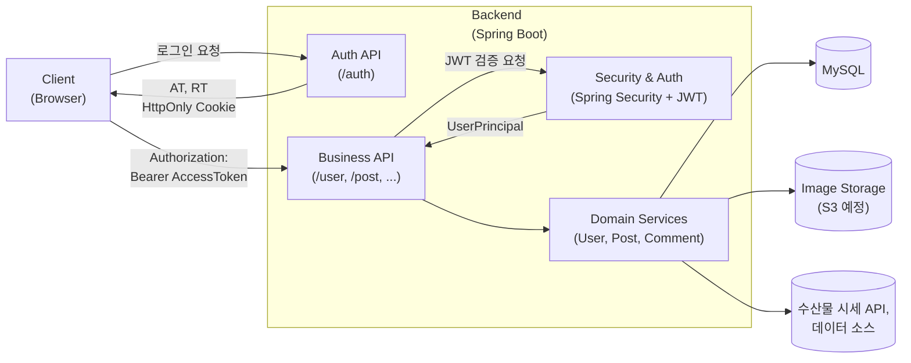

# 🐟 오늘의 수산 (Today’s Seafood)

<p align="center">
  
</p>

# 🐟 오늘의 수산?

> 오늘의 수산은 당일 수산물 시세 정보를 제공하고,<br>
> 사용자들이 실시간으로 정보를 공유할 수 있도록 만든 <strong>수산물 커뮤니티 서비스</strong>입니다.
> <br>

<br>
수산물의 가격은 계절·날씨·어획량·무역·경제 등 다양한 요인에 따라 크게 변동됩니다.<br>
사용자가 “적정 가격”을 판단할 수 있도록 기준이 되는 데이터와 커뮤니티 공간을 제공하는 것이 목표입니다.<br>

<br>

> 직접 수산 시장에 갔을 때, 1kg 기준 적정가를 몰라 헤맸던 경험에서 출발한 프로젝트입니다.
> <br>(25년 11월 꽃게… 기억이 선명합니다 🦀)

---

## 🔗 DEMO / DOCS

⚠️ 배포 전

---

## 개발인원 및 기간

-   개발 기간 : 2025.9.22 ~ ing
-   개발 인원 : 1인 개발(Fullstack)

---
## 🎯 Features

### 📈 수산물 시세 조회(예정)

-   전국 공영 도매시장 데이터를 기반으로 한 당일 시세 제공
-   어종 / 지역 필터링
-   어종별 차트(캔들 차트) 시각화 제공
-   하루 단위 변동성, 평균가, 최고 / 최저가

### 💬 실시간 사용자 소통(예정)

-   어종별 차트 페이지에 "현재 접속 중인 사용자 수" 표시
-   WebSocket 기반의 실시간 채팅

### 🐟 수산 커뮤니티

-   게시글 작성 / 수정 / 삭제
-   댓글 등록 / 수정 / 삭제
-   좋아요
-   무한 스크롤 기반 게시글 목록

### 👤 개인 프로필

-   프로필 이미지 업로드
-   닉네임 변경
-   사용자 작성 글 관리

----

## 🌐 Deployment URL (Production)

배포가 완료되면 아래 주소로 접속할 수 있습니다.

### 🐟 오늘의 수산 (Front-end)

사용자가 실제로 접속하는 메인 서비스 URL

```
https://your-domain.com
```

### 🟨 Bank-end API 서버

Spring Boot 기반 REST API

```
https://api.your-domain.com
```

---

## 📘 Document

### API Document(Swagger UI)

```
📄 https://api.your-domain.com/swagger-ui.html
```

---

## 🖥 개발환경 / Quick Start(예정)

### BackEnd

`Language` : Java 21

`Framework` : Spring Boot 3.5.6

### Dependencies :

```java
    dependencies {
      implementation 'org.springframework.boot:spring-boot-starter-thymeleaf'
      implementation 'org.springframework.boot:spring-boot-starter-web'
      implementation 'org.springframework.boot:spring-boot-starter-aop'
      implementation 'org.springframework.boot:spring-boot-starter-validation'
      implementation 'org.springdoc:springdoc-openapi-starter-webmvc-ui:2.7.0'
      implementation 'org.springframework.boot:spring-boot-starter-data-jpa'
      implementation 'org.springframework.boot:spring-boot-starter-jdbc'
      implementation 'org.projectlombok:lombok'
      implementation 'com.github.gavlyukovskiy:p6spy-spring-boot-starter:1.12.0'
      implementation 'org.springframework.boot:spring-boot-starter-security'

      runtimeOnly 'com.mysql:mysql-connector-j'
      testRuntimeOnly 'org.junit.platform:junit-platform-launcher'
      testImplementation 'org.springframework.boot:spring-boot-starter-test'
    }
```

### 🔐 Security

-   `Srping Security (JWT 기반 인증 & 인가)`
-   `AccessToken + Refresh Token (HttpsOnly Cookie)`
-   `Role, Action 분리 권한 부여`

### 🔒 Https

-   `로컬 환경에서 Self-Signed SSL 인증서로 HTTPS 환경 구축`

### 🗄 Persistence

- `Spring Data JPA + Hibernate`

### 💾 DB

- `MySQL 9.5.0`

---

## Configuration Step(dev.yml 예시)

Step1. JWT 토큰 설정

```yml
token:
    secretkey: #토큰 암호화 키
    issuer : # Payload 발급자
    access-token-ttl-millis: # Access Token 만료 시간
    refresh-token-ttl-millis: # Refresh Token 만료 시간
```

Step2. 쿠키 설정

```yml
cookie:
    refresh-token-cookie-name: #리프레시 토큰 이름
    refresh-token-cookie-path: #리프레시 토큰 요청 Path
    refresh-token-cookie-max-age: #리프레시 토큰 만료 기간
    refresh-token-cookie-same-site: # Lax / Strict / None
    refresh-token-cookie-domain: #쿠키 출처 도메인
```

Step3. CORS 설정

```yml
cors:
    allowed-origins: # 요청 허용하 도메인 목록
    allowed-methods: # 허용 HTTP 메소드
    allowed-headers: # cross-site 요청 시 허용할 헤더
    exposed-headers: # 클라이언트 접근 가능한 헤더
    max-age: # Preflight 요청 캐싱 시간
    url-source: # CORS 적용할 서버 내부 URL 패턴
```

Step4. DB 연결

```yml
datasource:
    url: # DB 주소
    username:
    password:
    driver-class-name: # DB Driver 종류
```

Step5. SSL 인증 설정

```yml
ssl:
    enabled: # SSL 사용 여부
    key-store: # 인증키 저장소 위치(path)
    key-store-password: # 인증키 비밀번호
    key-store-type: # 인증키 저장 타입, 인증서 종류
    key-alias: # 인증키 이름
```

---

## 아키텍처 개요


---

## 📊 DataSet

### 한국농수산식품유통공사 (데이터 검증 전)

전국 공영도매시장 실시간 경매정보(공공데이터 포함)

-   어종 / 지역별 시세 데이터 확보

https://www.data.go.kr/data/15141808/openapi.do

### 노량진 수산 시장, 오늘의 시세

-   노량진 수산 시장 당일 경매 시세 데이터

https://www.susansijang.co.kr/nsis/miw/ko/info/miw3110
